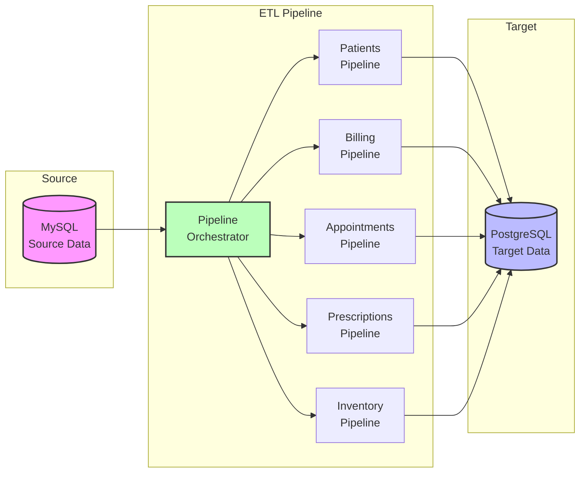

# HMS Data Pipeline

A comprehensive ETL (Extract, Transform, Load) pipeline system for Hospital Management System data, designed to process and migrate data from MySQL to PostgreSQL with robust error handling, logging, and idempotency features.

## 🏥 Overview

This project implements a complete data pipeline **simulation** for hospital management systems, processing various data domains including patient demographics, billing, appointments, prescriptions, and inventory management.

### 🎯 Project Inspiration

I was thinking about my next project to build, and I wondered how it'd be like working as a data engineer at a hospital. So I created **simulative data** using the `faker` module and `random` to generate realistic hospital data, and I loaded the data into MySQL which represented the central database system for the HMS. So now I had my representative data residing in MySQL (which is local, the reason why it is not in the docker-compose file).

I built these pipelines to simulate a real-world data engineering project, implementing industry-standard ETL practices and patterns.

### 🚀 Future Upgrades

This is currently a **batch processing simulation**. In future upgrades, I plan to:

- **PySpark Integration**: Implement distributed data processing using Apache Spark
- **Real-time Streaming**: Add real-time data processing capabilities using Apache Kafka or similar
- **Cloud Deployment**: Deploy on cloud platforms (AWS, GCP, Azure)
- **Advanced Analytics**: Implement machine learning pipelines for predictive analytics
- **Data Quality Monitoring**: Add comprehensive data quality checks and monitoring
- **CI/CD Pipeline**: Implement automated testing and deployment

## 🏗️ System Architecture



### Architecture Overview

**Simple 3-Tier Architecture:**
1. **Source Layer**: MySQL database with simulation data
2. **Processing Layer**: ETL pipelines with orchestration
3. **Target Layer**: PostgreSQL database for processed data

**Key Components:**
- **Orchestrator**: Manages pipeline execution order and error handling
- **Individual Pipelines**: Process specific data domains
- **Shared Utilities**: Database connections, logging, transformations

## 📊 Data Domains

The pipeline processes the following data types:

- **Patients Demographics**: Core patient information with address parsing and data standardization
- **Billing Data**: Financial transactions with payment status tracking
- **Appointments**: Scheduling data with attendance tracking
- **Prescriptions**: Medical prescriptions with drug and dosage information
- **Inventory Items**: Stock management with supplier tracking

## 🏗️ Architecture

```
HMS_Data_Pipeline/
├── etl/
│   ├── pipelines/           # Individual ETL pipeline modules
│   │   ├── patients_pipeline.py
│   │   ├── billing_pipeline.py
│   │   ├── appointments_pipeline.py
│   │   ├── prescriptions_pipeline.py
│   │   └── inventory_pipeline.py
│   └── utils/              # Shared utilities
│       ├── db_config.py    # Database connection management
│       ├── idempotency.py  # Idempotency and tracking
│       ├── logger.py       # Logging configuration
│       └── transformations.py # Data transformation utilities
├── tracking/               # Pipeline state tracking files
├── logs/                   # Pipeline execution logs
├── notebooks/              # Jupyter notebooks for development
├── generate_data.py        # Data generation scripts
├── run_pipelines.py        # Main orchestration script
└── docker-compose.yaml     # Docker configuration
```

## 🚀 Features

### Core Features
- **Batch Processing**: Memory-efficient processing with configurable batch sizes
- **Idempotency**: File-based tracking system for restart capability
- **Error Handling**: Comprehensive error handling with detailed logging
- **Data Validation**: Automatic data cleaning and standardization
- **Logging**: Detailed logging for monitoring and debugging

### Data Transformations
- **Date Standardization**: Consistent date format handling
- **Address Parsing**: Smart address splitting for patient data
- **Data Type Conversion**: Automatic type casting and validation
- **Missing Value Handling**: Intelligent default value assignment
- **Duplicate Removal**: Automatic duplicate record detection

## 📋 Prerequisites

- Python 3.8+
- MySQL 8.0+ (local installation for simulation data)
- PostgreSQL 12+
- Docker and Docker Compose (optional)

## 🛠️ Installation

1. **Clone the repository**
   ```bash
   git clone <repository-url>
   cd HMS_Data_Pipeline
   ```

2. **Install dependencies**
   ```bash
   pip install -r requirements.txt
   ```

3. **Set up environment variables**
   Create a `.env` file with your database credentials:
   ```env
   # MySQL Configuration (Local - Simulation Data)
   MYSQL_DB_USER=your_mysql_user
   MYSQL_DB_PASSWORD=your_mysql_password
   MYSQL_DB_HOST=localhost
   MYSQL_DB_PORT=3306
   MYSQL_DB_NAME=hms_data

   # PostgreSQL Configuration
   POSTGRES_HOST=localhost
   POSTGRES_PORT=5432
   POSTGRES_USER=postgres
   POSTGRES_PASSWORD=postgres
   POSTGRES_DB=hms_data
   ```

4. **Generate simulation data**
   ```bash
   # Generate sample hospital data
   python generate_data.py
   ```

## 🎯 Usage

### Running Individual Pipelines

```python
# Run specific pipeline
from etl.pipelines.patients_pipeline import run_pipeline
run_pipeline()
```

### Running All Pipelines

```bash
# Run complete pipeline suite
python run_pipelines.py
```

## 📈 Pipeline Execution Order

The orchestration script runs pipelines in the following order:

1. **Patients Pipeline** - Core demographic data
2. **Billing Pipeline** - Financial transactions
3. **Appointments Pipeline** - Scheduling data
4. **Prescriptions Pipeline** - Medical prescriptions
5. **Inventory Pipeline** - Stock management

## 🔧 Configuration

### Batch Size Configuration
Each pipeline uses a configurable batch size (default: 500 records):
```python
BATCH_SIZE = 500  # Adjust based on memory constraints
```

### Logging Configuration
Logs are automatically created in the `logs/` directory with timestamps:
```
logs/
├── patients_pipeline_2025-06-19.log
├── billing_pipeline_2025-06-19.log
└── ...
```

## 📊 Data Schema

### Patients Demographics
- `patient_id` (Primary Key)
- `first_name`, `last_name`
- `date_of_birth`
- `gender`, `blood_type`
- `phone_number`, `insurance_number`
- `street`, `city`, `state`, `zip` (parsed from address)
- `updated_at`

### Billing Data
- `invoice_id` (Primary Key)
- `patient_id` (Foreign Key)
- `service_code`, `amount`
- `payment_status`
- `updated_at`

### Appointments
- `appointment_id` (Primary Key)
- `patient_id`, `doctor_id`
- `appointment_date`
- `status`, `no_show`

### Prescriptions
- `prescription_id` (Primary Key)
- `patient_id`, `doctor_id`, `drug_id`
- `drug_name`, `dosage`
- `dispensed_date`

### Inventory Items
- `item_id` (Primary Key)
- `item_name`, `supplier`
- `quantity`, `reorder_level`
- `updated_at`

## 🔍 Monitoring and Debugging

### Log Files
- Check individual pipeline logs in `logs/` directory
- Monitor orchestration logs for overall execution status
- Review tracking files for pipeline state

### Tracking Files
Pipeline state is tracked in JSON files:
```json
{
  "table_name": "patients_demographics",
  "last_processed_id": "PT1000",
  "last_processed_timestamp": "2025-06-19T10:30:00",
  "batch_size": 500,
  "status": "completed"
}
```

## 🤝 Contributing

1. Fork the repository
2. Create a feature branch
3. Make your changes
4. Add tests for new functionality
5. Submit a pull request

---

**Note**: This is a **simulation project** for learning and demonstration purposes. The data is generated using the `faker` library and does not represent real patient information. In a real-world scenario, this would need to comply with healthcare data regulations (HIPAA, GDPR, etc.).
