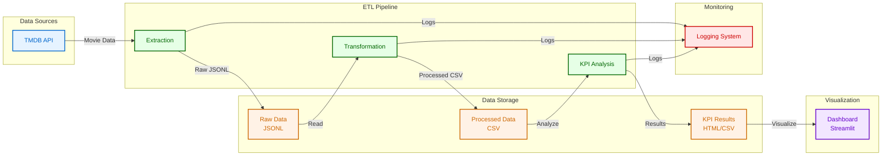

# Movie Analysis Pipeline

A data engineering project that extracts, transforms, and analyzes movie data from The Movie Database (TMDB) API. The project includes an automated ETL pipeline and an interactive dashboard for data visualization.

## Project Structure

```
Movie_Analysis/
├── configs/             # Configuration files
│   └── logger_config.py # Logging configuration
├── data/               # Data storage
│   ├── raw/           # Raw API data
│   ├── processed/     # Transformed data
│   └── kpi_analysis/  # KPI analysis results
├── logs/              # Log files
├── notebooks/         # Jupyter notebooks for development
├── src/              # Source code
│   ├── main.py       # Main ETL pipeline
│   ├── utils.py      # Utility functions
│   ├── kpi_analysis.py # KPI analysis functions
│   └── dashboard.py  # Streamlit dashboard
├── requirements.txt   # Python dependencies
└── readme.md         # Project documentation
```

## System Architecture



The architecture diagram above illustrates:

1. **Data Sources**
   - TMDB API as the primary data source

2. **ETL Pipeline**
   - Extraction: Fetches data from TMDB API
   - Transformation: Processes and structures the data
   - KPI Analysis: Generates metrics and visualizations

3. **Data Storage**
   - Raw Data: JSONL files containing API responses
   - Processed Data: CSV files with structured data
   - KPI Results: HTML visualizations and CSV reports

4. **Visualization**
   - Interactive Streamlit dashboard
   - Real-time updates with file watcher

5. **Monitoring**
   - Comprehensive logging system
   - Separate log files for each pipeline stage

## Features

- **Data Extraction**: Fetches movie data from TMDB API
- **Data Transformation**: Processes raw data into a structured format
- **KPI Analysis**: Generates key performance indicators and visualizations
- **Interactive Dashboard**: Real-time data visualization using Streamlit
- **Automated Pipeline**: End-to-end ETL process with error handling and logging

## Prerequisites

- Python 3.8+
- TMDB API key

## Installation

1. Clone the repository:
```bash
git clone <repository-url>
cd Movie_Analysis
```

2. Create and activate a virtual environment:
```bash
python -m venv venv
source venv/bin/activate  # On Windows: venv\Scripts\activate
```

3. Install dependencies:
```bash
pip install -r requirements.txt
```

4. Set up environment variables:
Create a `.env` file in the project root and add your TMDB API key:
```
TMDB_API_KEY=your_api_key_here
```

## Usage

### Running the ETL Pipeline

To run the complete ETL pipeline:
```bash
python src/main.py
```

This will:
1. Extract movie data from TMDB API
2. Transform the data into a structured format
3. Generate KPI analysis and visualizations

### Running the Dashboard

To start the interactive dashboard:
```bash
streamlit run src/dashboard.py
```

The dashboard will automatically update when new data is processed.

## Data Flow

1. **Extraction**:
   - Fetches movie data from TMDB API
   - Saves raw data as JSONL files in `data/raw/`

2. **Transformation**:
   - Processes raw data into structured format
   - Handles nested fields (genres, production companies, etc.)
   - Saves processed data as CSV in `data/processed/`

3. **KPI Analysis**:
   - Calculates basic metrics (total movies, revenue, etc.)
   - Generates visualizations (revenue vs budget, ratings)
   - Performs genre analysis
   - Saves results in `data/kpi_analysis/`

## Logging

The project uses a comprehensive logging system:
- Main pipeline logs: `logs/main_pipeline.log`
- Extraction logs: `logs/extraction.log`
- Transformation logs: `logs/transformation.log`
- KPI analysis logs: `logs/kpi.log`

## Contributing

1. Fork the repository
2. Create a feature branch
3. Commit your changes
4. Push to the branch
5. Create a Pull Request

